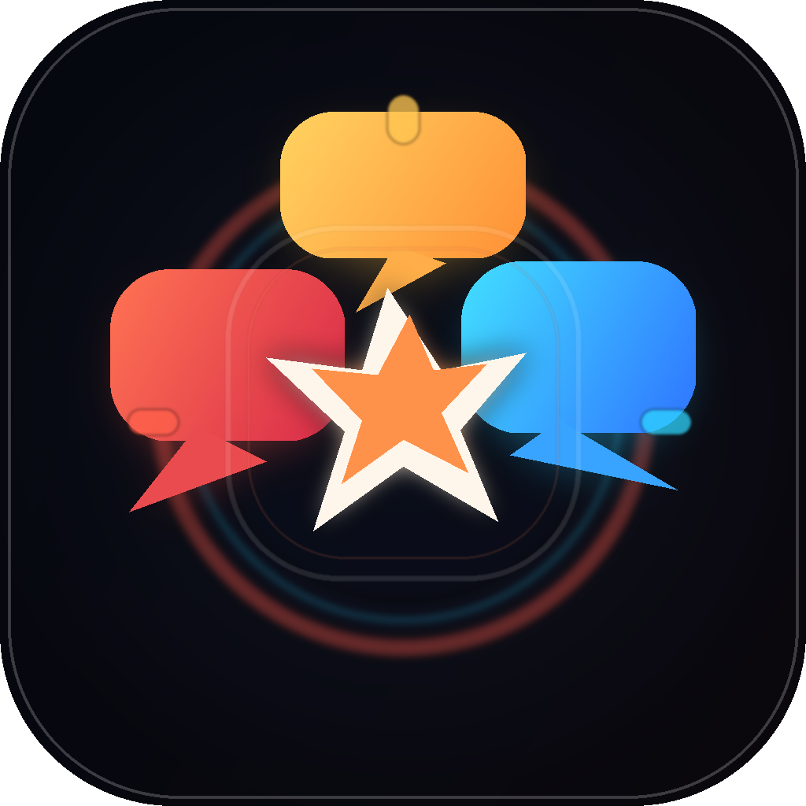

# GoT0AgentBattle

<p align="center">
  
</p>

<p align="center">
  一个基于 Go + Wails + React 的桌面端 AI 多角色辩论模拟器。<br />
  核心目标不是严肃论证，而是节目效果、角色冲突、自动互喷和实时观战体验。
</p>

<p align="center">
  
  
  
  
  
  
</p>

## 当前版本

- 仓库版本真源：[`/.version`](/Users/joker/Code/GoT0AgentBattle/.version)
- 当前版本号：`v0.1.0`
- 前端包版本会通过 `scripts/sync_version.py` 自动同步为去掉 `v` 前缀的 SemVer，例如 `0.1.0`

## 项目简介

用户输入一个辩论主题后，系统会拉起多个人格化 AI 角色，让他们围绕同一话题连续输出、互相点名、互相拆台，最后由裁判角色给出总结、胜负和节目效果评分。

典型使用场景：

- 看多个模型从不同人格视角互喷同一个技术话题
- 做桌面端 AI 节目化演示
- 用人格配置和模型分配测试“谁更适合当嘴替”
- 把辩论记录本地归档成 Markdown

## 核心特性

- 真实模型引擎，不走 mock 生成器
- 基于 YAML 的模型档案加载
- 多人格逐回合实时辩论与裁判总结
- 用户可插嘴、带节奏、指定攻击对象
- 设置中心可编辑人格库与默认房间参数
- 随机人格生成器
- React + Ant Design + Framer Motion 正式前端链路
- 辩论结束后自动保存本地 Markdown 对话记录
- 主舞台可展示热度、戏剧张力、当前集火对象和观众风向

## 当前技术栈

**后端**

- Go
- Wails
- Goroutine
- Wails Events

**前端**

- React
- Vite
- Ant Design
- TailwindCSS 基础结构已保留
- Framer Motion

**模型接入**

- OpenAI
- Claude
- Gemini
- DeepSeek
- Ollama

## 界面与玩法

应用分为三个核心区域：

- 左侧：角色席位，展示头像、状态、支持率、Token 使用量
- 中间：主聊天室与舞台横幅，展示实时消息流、回合推进、集火目标、热度与戏剧张力
- 右侧：导播控制台，负责建房、配置模式、启动辩论、查看实时排行与裁判结论

玩法上强调：

- 多角色混战
- 角色人格差异
- 实时聊天室氛围
- 节目感而不是严肃学术风

## AI 综艺舞台机制

当前版本不只是“几个模型轮流发言”，而是尽量把整场体验做成可展示的 AI 综艺舞台：

- 逐回合实时调度：真实模型按回合逐个出牌，不再等整场结束才一次性灌出消息
- 观众带节奏：用户插嘴会进入待处理队列，并在后续发言中真实影响下一位选手的输出角度
- 指定攻击对象：观众可指定 target，让后续回合优先转火到某个角色
- 舞台态势信号：后端会持续输出热度、戏剧张力、当前 speaker、当前 target、观众风向
- 角色节奏值：每个 Agent 除愤怒值和支持率外，还会积累 momentum 与开火次数，方便观察谁正在控场
- 消息播出 cue：每条聊天消息都带有 cue / impact / heatDelta / supportDelta，前端可直接做节目化播报

这意味着它更接近：

- 一个 AI 综艺 demo
- 一个可现场演示的多模型嘴替舞台
- 一个围绕“人格冲突 + 实时观战”打造的桌面节目

而不是：

- 通用 Agent 框架
- 严肃辩论评测平台
- 静态脚本生成器

## 快速开始

### 1. 安装依赖

确保本机已安装：

- Go 1.23+
- Node.js 18+
- Wails CLI 2.x

安装 Wails CLI：

```bash
go install github.com/wailsapp/wails/v2/cmd/wails@latest
```

### 2. 安装前端依赖

项目当前默认使用淘宝镜像源安装前端依赖：

```bash
cd frontend
npm install --registry=https://registry.npmmirror.com
cd ..
```

### 3. 准备模型配置

复制示例配置：

```bash
mkdir -p config
cp config/got0agentbattle.config.example.yaml config/got0agentbattle.config.yaml
```

然后填写你自己的：

- `base_url`
- `api_key`
- `model`
- `default_judge_profile_id`

### 4. 启动开发环境

```bash
wails dev
```

### 5. 构建桌面应用

```bash
wails build -nopackage
```

构建产物默认位于：

- `build/bin/GoT0AgentBattle`
- `build/bin/GoT0AgentBattle.app`

## 版本号规范

项目统一使用 **SemVer + `v` 前缀** 作为发布标签规范：

- 正式版本：`v0.1.0`
- 补丁版本：`v0.1.1`
- 次版本：`v0.2.0`
- 主版本：`v1.0.0`

约束规则：

- 仓库唯一版本真源是根目录的 [`.version`](/Users/joker/Code/GoT0AgentBattle/.version)
- Git tag 必须与 `.version` 完全一致
- `frontend/package.json` 的 `version` 通过脚本同步，不手改
- 建议每次发版都先更新 `.version`，再执行同步与校验

同步命令：

```bash
python3 scripts/sync_version.py
```

## GitHub Actions 规范

仓库已提供两条工作流：

- [`.github/workflows/ci.yml`](/Users/joker/Code/GoT0AgentBattle/.github/workflows/ci.yml)
- [`.github/workflows/release.yml`](/Users/joker/Code/GoT0AgentBattle/.github/workflows/release.yml)

### CI

`CI` 在以下场景触发：

- push 到 `main` / `master`
- pull request

CI 会执行：

- 同步 `.version` 到前端元数据
- 校验 `.version` 与 `frontend/package.json` 是否一致
- `npm ci`
- `npm run build`
- `go test ./...`
- 校验 `wails.json` 仍指向正式前端构建命令

### Release

`Release` 在推送符合 `v*.*.*` 的 tag 时触发。

Release 会执行：

- 校验 Git tag 是否与 `.version` 一致
- 同步版本元数据
- 安装前端依赖并构建
- 执行 `go test ./...`
- 按平台编译 Wails 桌面应用
- 自动创建 GitHub Release，并上传可直接下载的软件包

当前 Release 目标产物：

- `linux-amd64`：`GoT0AgentBattle-vX.Y.Z-linux-amd64.tar.gz`
- `windows-amd64`：`GoT0AgentBattle-vX.Y.Z-windows-amd64.zip`
- `macos-arm64`：`GoT0AgentBattle-vX.Y.Z-macos-arm64.zip`

### 推荐发布流程

```bash
# 1. 修改版本真源
printf 'v0.1.0\n' > .version

# 2. 同步前端版本
python3 scripts/sync_version.py

# 3. 本地验证
go test ./...
cd frontend && npm run build && cd ..

# 4. 提交后打 tag
git tag v0.1.0
git push origin main --tags
```

## 模型配置说明

应用启动时会优先读取本地 YAML 配置文件，不再通过设置中心配置模型。

默认加载顺序：

1. 环境变量 `GOT0_AGENT_BATTLE_CONFIG`
2. `./got0agentbattle.config.yaml`
3. `./got0agentbattle.config.yml`
4. `./config/got0agentbattle.config.yaml`
5. `./config/got0agentbattle.config.yml`
6. 兼容旧版 JSON 配置

示例结构：

```yaml
default_judge_profile_id: judge-main

profiles:
  openai-main:
    name: OpenAI 主力
    base_url: https://api.openai.com/v1/chat/completions
    api_key: sk-your-openai-key
    model: gpt-4.1
    timeout_seconds: 90
    retry_attempts: 2
    retry_delay_seconds: 2
```

说明：

- `profiles` 是可复用模型档案库
- 人格会绑定到具体 profile id
- 裁判模型也从这里取
- 如果未检测到有效配置，应用可以建房，但不能启动真实辩论

## 设置中心说明

设置中心当前只负责节目侧配置，不负责模型接入配置。

可在设置中心中维护：

- 默认辩论模式
- 默认回合数
- 默认上场人数
- 主题视觉风格
- 人格库
- 人格系统 Prompt

不会在设置中心中维护：

- API Key
- 模型供应商
- 裁判模型选择
- 模型档案编辑

## 本地数据与输出

### 设置文件

应用会自动保存本地设置文件：

- `got0agentbattle.settings.json`
- 或 `config/got0agentbattle.settings.json`

主要保存：

- 人格库
- 默认房间配置
- 前端主题风格

### 对话记录

每场真实辩论结束后，会自动输出本地 Markdown 记录：

- 目录：`data/transcripts/`
- 格式：`.md`

内容包括：

- 辩题
- 回合信息
- 出场人格
- 全量消息时间线
- 裁判总结
- 支持率快照

## 项目结构

```text
.
├── .github/workflows/           # CI 与 Release 工作流
├── .version                     # 仓库唯一版本真源
├── build/                      # Wails 构建资源与桌面端图标
├── config/                     # YAML 模型配置示例
├── data/transcripts/           # 本地 Markdown 辩论归档
├── docs/assets/                # README 展示资源
├── frontend/                   # React + Vite + Ant Design 前端
├── internal/battle/            # 辩论服务、模型调度、人格与转录
├── scripts/                    # 本地脚本（图标生成、版本同步等）
├── Agent_Muti/                 # 旧版 CLI 原型参考
├── main.go                     # Wails 入口
└── wails.json                  # Wails 构建配置
```

## 当前已实现

- 真实模型请求层已迁入新的 `internal/battle` 服务
- 不再使用 mock 引擎
- 主题必须手动输入
- 内置多个人格模板
- 支持随机人格生成
- 中文化人格风格标签与界面文案
- Ant Design 正式前端界面
- 多 Agent 逐回合实时辩论调度
- 观众插嘴真实参与后续回合
- 舞台热度、戏剧值、集火对象、观众风向展示
- Markdown 本地归档

## 后续方向

- 更强的辩论调度与反驳链条
- 红蓝对抗、擂台模式等差异化策略
- 更丰富的人格包导入导出
- GitHub 仓库化与发布流程整理
- 更细粒度的人格到模型映射管理
- 手动拆包与更极致的前端体积优化

## 开发说明

常用命令：

```bash
# Go 测试
go test ./...

# 前端构建
cd frontend && npm run build

# 同步版本
python3 scripts/sync_version.py

# 桌面构建
wails build -nopackage
```

重新生成应用图标：

```bash
python3 scripts/generate_app_icon.py
```

## 截图与演示

当前仓库还没有正式截图目录。如果你要，我下一步可以继续补：

- 主舞台截图
- 设置中心截图
- 裁判总结页截图
- 一组用于 GitHub 首页的产品展示图

## 说明

- 当前仓库未声明正式开源许可证，README 中未写死具体 License 条款
- `Agent_Muti` 目录保留为历史原型参考，不参与桌面主链路运行
